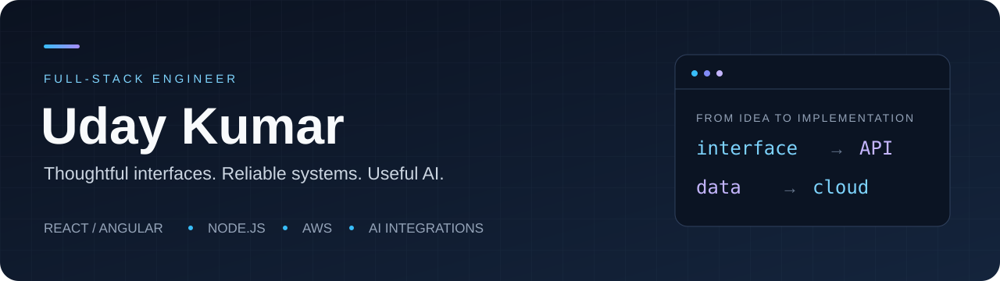

  

  
  
  

<b>4+ years building web applications · Frontend, backend &amp; cloud · MERN / MEAN</b>

I'm **Uday**, a full-stack engineer at **NCompass TechStudio**. I work across React and Angular interfaces, Node.js APIs, real-time systems, and AWS media workflows. I also build personal products and practical AI integration examples.

### Experience that translates into delivery

- **Frontend performance:** improved performance by approximately **30%** through lazy loading, memoization, virtual scrolling, and rendering optimization.
- **End-to-end engineering:** REST APIs with authentication and role-based access, MongoDB data models, and real-time communication with Socket.IO.
- **Product experience:** multi-tenant SaaS, analytics dashboards, warehouse interfaces, and livestream processing workflows.

Experience and impact highlights from my <a href="https://udaykumar.abuk.in">portfolio</a> · Software Developer, 2022–present · Integrated M.Tech in Software Engineering, VIT, 2017–2022.

## Selected builds

<table>
<tr>
<td width="50%" valign="top">

### ◉ Pulse · Habit Tracker
**A daily productivity app for web and mobile.**

Track action and measurable habits, streaks, progress, and expenses. Includes user-scoped APIs, JWT authentication, and a React Native / Expo companion.

React · TypeScript · Express · MongoDB · Expo

**[Visit live app ↗](https://habbit.abuk.in)** · **[Explore code →](https://github.com/UK0724/Habbit-tracker)**  
Live app requires sign-in.

</td>
<td width="50%" valign="top">

### ✦ CopilotKit Guide
**AI assistants connected to real application context.**

A Sprint Board demo showing context injection, frontend tool execution, and AG-UI streaming. Companion examples are organized by episode.

Next.js · React · TypeScript · CopilotKit · Gemini

**[Explore code & run locally →](https://github.com/UK0724/copilot)**

</td>
</tr>
<tr>
<td width="50%" valign="top">

### ▤ Bookshelf
**A personal reading companion.**

Organize books by reading status and tags, track reading statistics, and manage a library through an authenticated API.

Next.js · Tailwind CSS · Express · MongoDB

**[Explore code →](https://github.com/UK0724/Personal-Book-Manager)**

</td>
<td width="50%" valign="top">

### ☁ Serverless S3 Uploads
**Direct media uploads with presigned URLs.**

An AWS example connecting API Gateway, Lambda, and S3 for image and video uploads.

JavaScript · Amazon S3 · Lambda · API Gateway

**[Explore code →](https://github.com/UK0724/aws-s3-presigned-url-upload)**

</td>
</tr>
</table>

## My toolkit

  
  
  
  
  
  
  
  

**Also work with:** NestJS, Express, Tailwind CSS, TanStack Query, Socket.IO, React Native / Expo, and CopilotKit.

## A closer look at my work

[Explore professional projects and experience on my portfolio →](https://udaykumar.abuk.in)

---

### Have a role or a project in mind?

I'm interested in teams that value ownership, engineering quality, and useful products. For **frontend or full-stack opportunities**, or to collaborate on a build, let's talk.

**[LinkedIn](https://www.linkedin.com/in/uday-kumar-a-b-b15716216/) · [Email](mailto:ab.udaykumar@gmail.com) · [Portfolio](https://udaykumar.abuk.in)**

